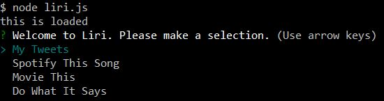
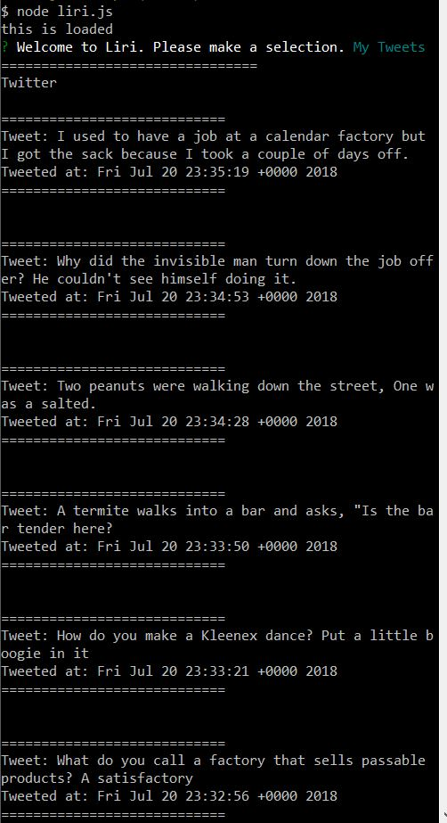
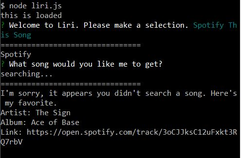
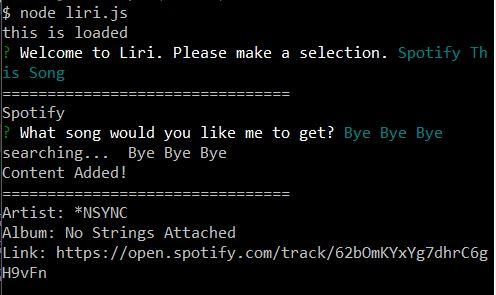
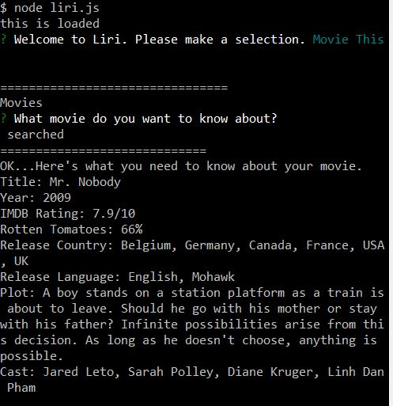
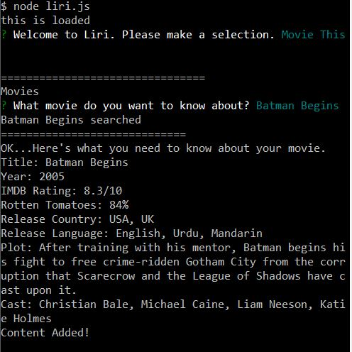
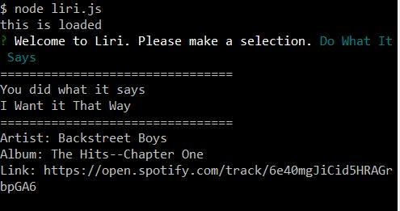

# liri-node-app

https://danielpruitt.github.io/liri-node-app/

LIRI is a node application that utilizes user choices and input to return data from the OMDB, Twitter, or Spotify API. Upon starting LIRI the user is prompted to make a choice between "My Tweets", "Spotify This Song", "Movie This", or "Do What It Says". The Inquirer node package allows for the choices to be taken and then process with specified functions. Below is a breakdown of what each choice returns to the user as well as other node packages and APIs. 

The Request and FS is used throughout the node application.

---My Tweets---
Selecting My Tweets will return the users previous 20 tweets. Currently, the Twitter account is hardcoded to myself. 
Simply by choosing the My Tweets option will return this data and no further action is needed from the user. 
The Twitter API is called to return the tweet and the time it was posted. 

Resources used: node package: Twitter API: Twitter

---Spotify This Song---
Selecting Spotify This Song will prompt the user to input a song on the command line. Quotations or dashes are not needed becasue the prompting is utilizing input from the Inquirer node package. The input is then set to a variable which is called into the Spotify API to return the Artist, Album, and the Spotify URL (originally the assignment was to link to the preview_url but "null" is returned on some songs so it was changed to the spotify web player link). If the user decides to leave the field blank and submit it the song "The Sign" by Ace of Base and it's corresponding data will be displayed. The input from the user is also logged into log.txt through FS.

Resurces used: node packages: spotify-web-api-node, inquirer API: Spotify

---Movie This---
Selecting Movie This is similiar to the Spotify This Song selection. It will prompt the user to type a movie into the command line and will set that movie to a variable. The data returned to the user is the movie's title, release year, IMDB and Rotton Tomatoes Ratings, release country, language, plot, and actors. The typed response will also be added to log.txt but if no response was added the data returned will be for the film Mr.Nobody. The input from the user is also logged into log.txt through FS.

Resurces used: node packages: OMDB, inquirer API: OMDB

---Do What It Says---
Selecting Do What It Says will read the data in the random.txt and then return Spotify data based from the file. This is utilizing the readFile function to extract the data. 

Resources used: node packages: spotify-web-api-node API: Spotify

Response Images:

